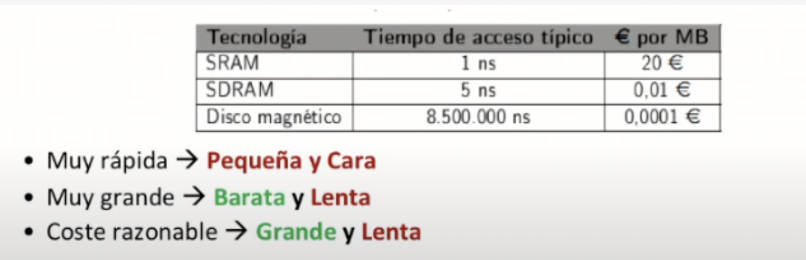
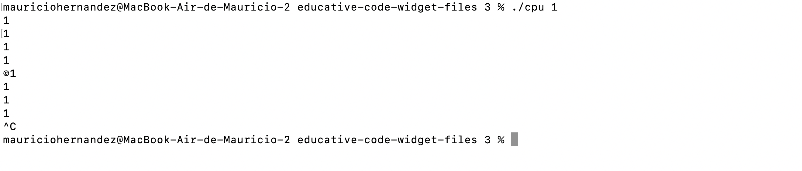
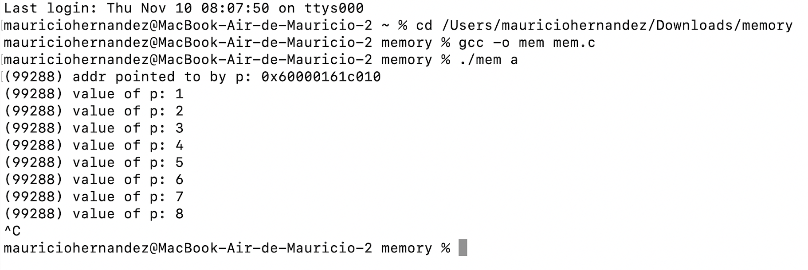
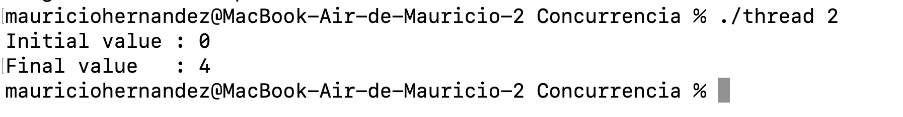

# Sistemas Operativos. 

**Alumno:**
*Victor Mauricio Hernandez Carreon.*

**Carrera:**
*ITIT.*

**Docente:**
*Jorge Luis Romo González.*

**Materia:** 
*Sistemas Operativos.*

##	¿Qué hace un sistema operativo?

Un sistema operativo es un conjunto de programas que se encarga de gestionar los recursos de hardware y provee servicios a los programas de aplicación de software. Estos programas se ejecutan en modo privilegiado respecto de los restantes.

El sistema operativo nos ayuda a visualizar y hacer mas didacticas e intuitivas las funciones de un componente, no solo existen sistemas operativos operativos para computadoras, si no para dispositivos móviles, relojes, televisores, electrodomesticos, etc.

##	¿Qué es el Open Source?

Durante muchos años, el software open Source se conoció con el nombre de "software libre". En 1983, Richard Stalleman estableció oficialmente el movimiento del software libre en el Proyecto GNU. 

Un Open Source hace referencia a todos aquellos programas informáticos que disponen a cualquier usuario el acceso a su código de programación facilitando por parte de otros programadosres ajenos la modificación del mismo.

Cuenta con muchas ventajas, como el que cualquier persona puede hacer uso del código, la transparencia y comunicación a la hora en la que los desarrolladores utilizan un open source para crear programas, no es necesario ningun tipo de licencia o tarifas extras, etc. 
Pero asi como tiene ventajas tambien tiene ciertas desventajas para los desarrolladores siendo una de las mas importantes la seguridad comprometida ya que la apertura del código y la ausencia de un sistema de protección puede perjudicar la seguridad de los datos.

##Historia de los sistemas operativos Mac OS, Ubuntu y Windows

En el mundo de la tecnología y los dispositivos, existe una gran diversidad de sistemas operativos y siendo unos mas populares que otros debido a su eficiencia a la hora de trabajar o navegar, facil manejo e intuitividad o simplemente por que son los mas accesibles y reconocidos como el sistema operativo Mac OS, Ubuntu y Windows. 

###Mac Os:
>El Mac OS ha sido el sistema operativo primario de Apple desde 1984. A diferencia de sus predecesores, Mac OS X es un sistema operativo tipo UNIX, el cual fue construido sobre la tecnología desarrollada por NeXT en la segunda mitad de los años 1980 hasta que Apple compró esta compañía a principios de 1997.

Estas son las algunas de las fechas mas importantes en el desarrollo de este sistema operativo:

**1969.** ***UNIX***

* Aporto el sistema POSIX, que actualmente usamos para medir el tiempo, ademas de originar tanto a Linux como OSX (mac). 

**1984.** ***System 1***

* Inclusión de "Finder". 
* Barra de menú. 
* Fue el primer sistema operativo de mac, creado por Motorola. 

**1985**. ***System 2, System 3***

* Añadido el "AppleTalk".
* Añadido el "LaserWriter". 
* Añadido el sistema de archivos HFS. 
* Soporte a SCI y AppleShare (sucesor de Airdrop). 

**1997.** ***MacOS 8*** 

* Mejoras en escritorio y memoria virtual. 
* Simple Finder para principiantes. 
* Nuevo panel de control. 

**2001.** ***MacOS X 10.0 “Cheetah”***

* Contenía todas características de un sistema operativo moderno.
*  Protección a la memoria, así los programas no podían utilizar la información de otros programas.
*   Mejoras del procesador evitando bloqueos.
*  Los drivers de los dispositivos podían ser cargados o descargados si eran necesario.

**2016.** ***MacOS Sierra***

* Cambio importante en cuanto al nombre, sería la primera vez desde el 2000 que se abandona el denominativo de Mac OS X. Ahora se llama simplemente macOS. 
* Nuevo sistema de archivos que permite copiar archivos y directorios de manera casi instantánea.

**2022.** ***MacOS Ventura***

* MacOs Ventura es la ultima actualización del sistema operativo MacOS, implementando una serie de funciones muy utiles para la vida diaria y aprovechando la compatibilidad con los dispositivos de ultima generación.

* Sus nuevas y poderosas funcionalidades permiten aumentar la productividad, colaborar sin salir de las apps y disfrutar juegos de última generación. Incluso se puede integrar a la Mac otros dispositivos para aprovecharlos al máximo.

### Ubuntu: 
>La primera versión de Ubuntu (Warty Warthog) fue lanzada el 20 de octubre de 2004. Ubuntu es un sistema operativo basado en Linux y que se distribuye como software libre, el cual incluye su propio entorno de escritorio denominado Unity. Es una distribución GNU/Linux que ofrece un interesante sistema operativo para equipos de escritorio y servidores en el ámbito educativo. Es una distribución basada en Debian cuyas principales características son: Facilidad de manejo. Actualizaciones frecuentes.

Estas son las algunas de las fechas mas importantes en el desarrollo de este sistema operativo:

**1991.**  ***Linux***

* En 1991, Linus Torvalds lo diseñó y creó a modo de pasatiempo. Mientras estaba en la universidad, intentó crear una versión open source, alternativa y gratuita del sistema operativo MINIX, que a su vez se basaba en los principios y el diseño de Unix.
* Este Sistema Operativo tiene variedades de distribuciones como Ubuntu, Debian, Kanjare, Fedore. 

**2004.** ***Ubuntu 4.10 – Warty Warthog***

* Nace el sistema operativo. Fue la primera publicación de Ubuntu realizada en octubre de 2004.

**2005.** ***Ubuntu 5.10 – Breezy Badger***

* Ubuntu comenzó a aumentar su número de usuarios rápidamente, además de conseguir mucha aceptación en la comunidad de Linux. Con la llegada de Breezy vino también el nacimiento de Edubuntu, una tercera distribución de Linux orientada al ámbito de la educación. También se incluyó soporte de servidor para Ubuntu. La distribución Kubuntu reemplazó Synaptic (gestor de paquetes) por Adept y se convirtió en la primera en usar devtags para una búsqueda más rápida de aplicaciones para Adept.

**2006.** ***Ubuntu 6.06 LTS – Dapper Drake***

* Disminución en el tiempo de carga del sistema.
* Apagado gráfico.
* Nueva herramienta de actualización.
* Mejoras en la reproducción de video. 

**2009.** ***Karmic Koala***

* Se lanzó oficialmente 29 de octubre del 2009 con un renovado diseño, el sistema operativo de libre distribución posee mayor velocidad de arranque, mejoras en los tiempos de inicio y apagado son parte de Ubuntu 9.10, mejoras en cuanto a la reproducción multimedia y una más eficiente conectividad 3G. También encontraremos una nueva aplicación Ubuntu Software Center, herramienta de gestión de aplicaciones orientada a la descarga y manejo de código abierto para su equipo

**2012.** ***Ubuntu 12.10 (Quantal Quetzal)***

* Nueva integración en el escritorio con Aplicaciones Web. Con esto el navegador Firefox consulta al usuario si quiere integrar un sitio como aplicación web, ello hace uso de notificaciones de escritorio, indicadores en el lanzador, acceso al menú de mensajería, también administrar imágenes, contactos, documentos en las secciones Fotos, Social, Archivos y carpetas, además de búsqueda de opciones de HUD.151 Se agregaron dos nuevas aplicaciones web al lanzador, Amazon y Ubuntu One Music.

**2016.** ***Ubuntu 16.04 LTS Xenial Xerus***

* El boletín informativo también ha informado de que la base que usan actualmente está en Linux 4.2 sobre la que trabajan para Ubuntu 16.04, aunque afirma que la versión Linux 4.3 está abierta para el desarrollo. El proceso de desarrollo de Ubuntu 16.04 LTS acaba de comenzar y todos esperamos que, aparte de mejoras en cuanto al kernel, tamibén incluya otras mejoras interesantes.

**2022.** ***Ubuntu 22.04 LTS (Jammy Jellyfish)***

* Linux Kernel 5.15, kernel en tiempo real.
* Wayland, por primera vez en Ubuntu LTS.
* GNOME 42, un amplio espectro de personalización.
* Mejoras de seguridad y otras actualizaciones.

###Windows

>En 1975 Bill Gates y Paul Allen fundaron la compañía Microsoft en Estados Unidos, con el objetivo de desarrollar y comercializar programas para ejecutar el Altair 8800, un microordenador diseñado en 1974. Gates y Allen desarrollaron el primer lenguaje de programación para el Altair Basic.

Estas son las algunas de las fechas mas importantes en el desarrollo de este sistema operativo:

**1975.** ***Microsoft BASIC***

* Fue creado para el Altair 8080, el primer ordenador de Microsoft. 

**1980.** ***Microsoft XENIX***

* Inclusión de elementos BSD.
* Shell visual para el usuario. 

**1981.** ***MS-DOS 1.0***

* Ejecución de archivos COM, EXE, BAT. 
* Comandos DIR, TYPE, COPY, ERASE, RENAME, PAUSE y REM. 

**1983.** ***MS-DOS 2.0***

* Subdirectorios (carpetas) y discos más grandes. 

**1984.** ***MS-DOS 3.0***

* Soporte con FAT16 de hasta 32 MB.  (FAT16: forma de resetear un disco duro.)
Reloj interno IBM AT. 

**1985.** ***Windows 1.0***

* Primera versión de Windows. Incluye un reloj, calendario, calculadora, bloc de notas, reversi (juego), etc. 

**1987.** ***Windows 2.0***

* Nuevos atajos de teclado. 
+ Opciones de minimización y maximización mejoradas. 

**1988.** ***MS-DOS 3.3***

* Soporte a disquetes con 1,44 MB.
* Particiones extensas de disco duro. 
* MS-DOS 4.0 
* Particiones de hasta 2 GB. 

**1988.** ***Windows 3.0***

* Interfaz renovada. 
* El lanzador de programas es reemplazado por el administrador de programas. 

**1992.** ***Windows 3.1***

* El juego Reversi es reemplazado por el Buscaminas. 
* Eliminado el soporte de gráficos CGA. 
* Aplicaciones en ventana DOS ganaron capacidad de manipular menús. 

**1995.** ***Windows 95***

* Agregada una nueva barra de tareas con botón ce inicio y reloj. 
* Escritorio con papelera de reciclaje. 
* Internet explorer. 

**1998.** ***Windows 98***

* Soporte de FAT32. 
* Nuevos controladores de hardware.
* Messenger (second edition).
* Compatibilidad con USB (second edition).

**2001.** ***Windows XP***

* Interfaz llamada luna. 
* Firewall. 

**2012.** ***Windows 8***

* Mejoras de desempeño.
* Navegación y apariencia.
* Administrador de Tareas en Windows 8.
* Juegos DirectX 11.
* Soporte nativo para USB 3.0.
* UAS 3.0 y Espacios de Almacenamiento.
* Mejores capacidades de sensor.
* Mejor seguridad y desempeño en el arranque.

***2015.*** ***Windows 10***

* Conexión entre varios dispositivos. 
* Ventana de Inicio. 
* Aplicaciones para todos los dispositivos. 
* Centro de notificaciones. 
* Integracion de la IA Cortana. 
* Microsoft Edge. 
* Integración con Xbox.

##Comandos básicos de la terminal Unix (terminal de Mac o Ubuntu)

La terminal es una interfaz de línea de comandos de Mac con la que puede acceder a la parte Unix de macOS para administrar archivos y ejecutar scripts a través de comandos de texto. 

A continuacion, algunos de los comandos principales.

* **pwd:** Muestra en dónde estas actualmente. 
* **ls:** Enlista los archivos que están dentro de esa carpeta. 
* **mkdir (espacio) "nombre de la carpeta":**  Sirve para crear una carpeta ahí.
* **cd (nombre de la carpeta para avanzar a la carpeta):** Para avanzar a la carpeta (entrar). 
* **touch (espacio) "nombre del archivo nuevo":**  Para crear un archivo en la carpeta.
* **vim (espacio) (nombre del archivo) .txt :** Es un editor de texto, para abrir la pantalla del archivo. Escribir la letra _*"i"*_ para comenzar a escribir, ***scape : wq:*** Es para guardar y salir. 
* **rm (espacio)(nombre del archivo):**  Sirve para eliminar los archivos. 
* **clear:** Este comando se encarga de impiar la pantalla y los comandos anteriormente escritos (no elimina lo que se hizo). 
* **cd:** Sirve para llevarte a la raíz o carpeta principal. 
* **cd .. :** Es para regresar de la carpeta, funciona como si le dieras a la flechita. 

##	Dispositivos de entrada/salida

###Dispositivos de entrada

>Los dispositivos de entrada son aquellos equipos encargados de introducir datos en la memoria central de la computadora para su tratamiento. A través de ellos se transforma la información de entrada en señales eléctricas.   

Ejemplos: 
 

`Teclado` `Ratón` `Joy Stick`  `Pluma de luz`  `Bola de pista`       
`Escáner` `Tableta digitalizadora`     `Micrófono`    

###Dispositivos de salida

>Los dispositivos de salida son los equipos que presentan la información al usuario de forma comprensible, ya sea a través de imágenes, texto, sonidos o táctil. Estos realizan la función de extraer datos de la memoria central hacia el exterior.  
  
Ejemplos: 
 

 `Monitor` `Impresora` ` Parlante`    
 `Auriculares. `
` Video Beams o proyectores.`

###Dispositivos Mixtos

> Los dispositivos de entrada y salida o dispositivos mixtos permiten la introducción y extracción de datos en la memoria central.   

Por ejemplo: 

`Smart phone` `Impresoras multifunción`  
`Pantalla táctil de una computadora` 

##	Procesos y algoritmo de planeación

###Qué es un proceso? 

Es el nombre con el que se denomina la ejecución de un programa individual, representado por una serie de instrucciones que el procesador debe ejecutar, la mayoría de los sistemas operativos modernos basan toda su estructura de diseño alrededor de este concepto. 

####De que consta?   
1.- *Identificador.*  
2.- ***Estado.***  
3.- *Prioridad.*   
4.- *Contador de programa.*   
5.- *Punteros a memoria.*   
6.- *Datos de contexto.*   
7.- *Información de estado de E/S.*   
8.- *Información de auditoría.*   

###Estado de un proceso
Cuando un proceso es ejecutado, éste cambia de estado.
El estado de un proceso es definido por la actividad que está ejecutado el proceso.

* **Nuevo (NEW):** El proceso se creó.  

- **Listo (READY):** El proceso espera a que sea asignado a un procesador (aquí el proceso se creo pero no esta corriendo aun).   

* **Corriendo (RUNNING):** Está ejecutando instrucciones. 
 
- **Esperando-bloqueado  (WAITING):** Esperando a que un evento ocurra (esperando a que un componente de I/O se conecte  o que se reciba señal).   

* **Terminado (FINISHING):** El proceso ha sido terminado la ejecución.

**Hilo (Thread):** *Una unidad de ejecución dentro de un proceso. Un proceso puede tener uno o muchos hilos.*  
**Compilador:** *Transforma lenguaje de alto nivel a bajo nivel.*

######*Una computadora solo entiende lenguaje de bajo nivel, específicamente, código binario.
  

###Planificación de procesos 
El planificador de procesos (process scheduler, en inglés) es la parte del sistema operativo que se encarga de seleccionar a qué proceso se asigna el recurso procesador y durante cuánto tiempo.  
El objetivo de la multiprogramacion es tener algun proceso corriendo en todo momento, para maximizar la utilización del CPU y el objetivo del tiempo compartido es cambiar la CPU entre procesos con tanta frecuencia que los usuarios puedan interactuar con cada programa mientras se ejecuta.

Un ejemplo de la planificación de procesos, puede ser que yo en el momento de hacer este proyecto, tengo varios programas abiertos, algunos archivos descargando y musica reproduciendo.   
Se puede creer que las tres cosas estan pasando el mismo tiempo pero no, el CPU esta constantemente cambiando entre procesos tan rápido, en cuestion de milisegundos que parce que se esta ejecutando al mismo tiempo.

##Almacenamiento

###Dispositivos de almacenamiento de datos

####· ¿Que son?
Un dispositivo de almacenamiento de datos es un conjunto de componentes electrónicos habilitados para leer o grabar datos en el soporte de almacenamiento de datos de forma temporal o permanente.

Algunos dispositivos pueden ser los discos duros, dvd, cd, pendrive, tarjeta SD, memory stick, disco duro portatil, disquete, entre otros. 

####· Función
Sirven para la recopilación y conservación de la información digital, es decir, de los bits y bytes que se encuentran detrás de las aplicaciones, los protocolos de red, los documentos, el contenido multimedia, las libretas de direcciones y las preferencias de los usuarios, entre otros.

###Unidades de almacenamiento

Así como usamos medidas para saber cuánto pesan o miden las cosas, también hay unidades de medida que permiten calcular la capacidad de almacenamiento de información o procesamiento de datos. 

Las unidades de medida más usadas son el Bit, Byte, Kilobyte, Megabyte, Gigabyte y Terabyte. 

Para entender mejor cómo se relacionan estas unidades de medida entre sí, observemos la siguente tabla de unidades:

|Unidad de medida| Símbolo  | Relación   |
|:-------------  |:-------- | :----------|
| Bit            | bit      | 1 bit      |
| Byte           | B        | 8 bits     |
| Kilobyte       | KB       | 1024 B     |
| Megabyte       | MB       | 1024 KB    |
| Gigabyte       | GB       | 1024 MB    |
| Terabyte       | TB       | 1024 GB    |

* La unidad minima o básica es el bit y se representa por la letra b, simplemente es un 0 o 1, hay corriente o no hay corriente.

* El Byte (B) es la primera unidad de almacenamiento que tiene sentido, esta compuesta por 8 bits, un Byte es aproximadamente un caracter.

* El Kilobyte(KB) equivale a 1024 Bytes.

* Megabyte(MB) 1024 KB.

* Gigabyte(GB) 1024 MB.

* Terabyte(TB) 1024 GB.

###Tabla de conversión
A veces algunos sistemas operativos o programas simplifican multiplicando o dividiendo por/entre 1000 en vez de 1024.

##Jerarquía de memoria
La jerarquía de memoria es la organización piramidal de la memoria en niveles que tienen las computadoras. El objetivo es conseguir el rendimiento de una memoria de gran velocidad al coste de una memoria de baja velocidad, basándose en el principio de cercanía de referencias.

###¿Por qué necesitamos una Jerarquía de Memoria?
Los usuarios pero sobre todo los programadores quieren una memoria **muy rápida**, **muy grande** y con un **coste razonable**.

 

* **SRAM (Static Random Access Memory):** *Es una memoria volatil, que quiere decir que los datos se pierden cuando es apgado el dispositivo. Se utiliza para implementar la cache.*

* **SDRAM (Synchronous dynamic random access memory):** *Se utiliza para implementar la memoria principal.*

##Ejemplos de Virtualización del CPU, Virtualización de Memoria, Concurrencia, Persistencia

### ·Virtualización del CPU:

> La virtualización de CPU es una característica de hardware que se puede encontrar en todos los procesadores modernos tanto de AMD como de Intel, y permite a un único procesador actuar como si fueran varios procesadores individuales. Esto permite que el sistema operativo sea capaz de utilizar la potencia del procesador de manera más efectiva y eficiente, o en otras palabras, que optimice mejor la potencia del procesador para hacer que el equipo funcione más rápido en muchos procesos complejos.

### ·Virtualización de memoria:

> El concepto es exactamente el mismo que para la virtualización de almacenamiento. La idea es crear una memoria de función compartida mediante una distribución en la red para que los distintos equipos la utilicen. Ofrece las mismas ventajas que el almacenamiento en red.

### ·Concurrencia:

>Concurrencia es la habilidad que tiene un computador de realizar varias tareas a la vez. Gracias a la concurrencia es que puedes ver un video en YouTube mientas subes un archivo a Dropbox y hablas con tus amigos en Facebook, todo a la vez.

### ·Persistencia:

>La persistencia es la acción de mantener la información del objeto de una forma permanente (guardarla), pero también debe de poder recuperarse dicha información para que pueda ser utilizada nuevamente. La persistencia es el mecanismo que se usa para mantener información almacenada.

